# mosaicG5 HAT user documentation
## Table of Content

* [mosaicG5 HAT User Documentation](#mosaicg5-hat-user-documentation)
  * [mosaicG5 HAT Manufacturing and Assembly](#mosaicg5-hat-manufacturing-and-assembly)
    * [Elements to provide when manufacturing the board](#elements-to-provide-when-manufacturing-the-board)
    * [Ordering mosaic module](#ordering-mosaic-module)
  * [General Interfaces of mosaicHAT](#general-interfaces-of-mosaichat)
  * [Connecting to Raspberry Pi](#connecting-to-raspberry-pi)
    * [Preparing Raspberry Pi](#preparing-raspberry-pi)
  * [GNSS Antenna](#gnss-antenna)
    * [Heading](#heading)
  * [USB Communication](#usb-communication)
  * [Serial Communication](#serial-communication)
  * [FTDI Connector](#ftdi-connector)
  * [LED Indicators](#led-indicators)
  * [Reset mosaic-G5](#reset-mosaic-g5)
  * [PPS Output](#pps-output)
  * [Events](#events)
  * [Python Script](#python-script)


## mosaicG5 HAT Manufacturing and Assembly

This project includes all the files required to manufacture the mosaicG5 HAT, including the reference design, PCB layout, and Bill of Materials (BOM). You can use these files with your preferred PCB manufacturer. For this project, we used [JLCPCB](https://jlcpcb.com/) for both PCB fabrication and assembly due to their competitive pricing and fast production times.

### Elements to provide when manufacturing the board
When you manufacture your board they will ask you for the following parts:

For the PCB only:
* The PCB design, you will need to export gerber and drill files 

For assembly:

* Bill of Materials (BOM), the list of components used in the project with their reference designators. For this project check [BOM](../BOM.xlsx).
* Component Placement List (CPL), this file contains the exact position of each component on the board (X,Y and rotation). CPL is exported from KiCad however, you need to check with the manufacturer services to ensure the right placement for components.

### Ordering mosaic module
You can order the mosaic-G5 from Digi-Key, or you can contact Septentrio at www.septentrio.com for purchasing inquiries or other mosaic models.

| mosaic-G5 versions | Septentrio | Digi-Key part_number|
|-----------------|------------|--------|
| mosaic-G5 P1 |[Septentrio_G5-P1](https://www.septentrio.com/en/products/gnss-receivers/gnss-receiver-modules/mosaic-g5-p1) | - |
| mosaic-G5 P3 | [Septentrio_G5-P3](https://www.septentrio.com/en/products/gnss-receivers/gnss-receiver-modules/mosaic-G5-P3) | [410501](https://www.digikey.com/en/products/detail/septentrio-inc/410501/28527327) |
| mosaic-G5 P3H |[Septentrio_G5-P3H](https://www.septentrio.com/en/products/gnss-receivers/gnss-receiver-modules/mosaic-G5-P3H) | [410502](https://www.digikey.com/en/products/detail/septentrio-inc/410502/28527213) |
| mosaic-G5 P6 |[Septentrio_G5-P6](https://www.septentrio.com/en/products/gnss-receivers/gnss-receiver-modules/mosaic-G5-P6) | [410503]() |
| mosaic-G5 P8 |[Septentrio_G5-P8](https://www.septentrio.com/en/products/gnss-receivers/gnss-receiver-modules/mosaic-g5-p8) | [410610]() |

## General interfaces of mosaicHAT
The board exposes the following interfaces:


## Connecting to Raspberry Pi
mosaicG5 HAT can be easily attached to Raspberry Pi as shown here:


### Preparing Raspberry Pi
To enable communication between mosaicG5 HAT and Raspberry Pi (RPi), you should make sure required serial communication settings are configured.

Raspberry Pi OS
* To enable RPi serial communication, go to terminal and run:

  ```sudo raspi-config```

* Select **Interfacing Options**, then from the menu select Serial Port.
You will get the question:
would you like a login shell to be accessible over serial?
select **No**. Another prompt will ask:
would you like serial port hardware to be enabled?
select **Yes**.

* Reboot the Raspberry Pi for the changes to take effect.

  ```sudo reboot```

* After reboot check UART devices

  ```ls -l /dev/serial* ```

The output should be similar to:

  ```/dev/serial0 -> ttyAMA0```

  ```/dev/serial1 -> ttyS0```

On the RPi 4 
serial0 maps to GPIO 14 and 15 which are connected to UART1 of the mosaic-G5. 

To communicate with UART1, use:

  ```/dev/serial0```

To enable RPi's UART, go to /boot/config.txt and set enable_uart=1 at the end of the file. This could be done directly on SD card or using:

  ```sudo nano /boot/config.txt```

when using the second UART connected from the mosaic-G5 module t the RPi 

add the line ```dtoverlay=uart3``` to the file to enable UART3 connected to the UART2 of the mosaic-G5 module

* Reboot the Raspberry Pi for the changes to take effect.

  ```sudo reboot```

* After reboot check UART devices

  ```ls -l /dev/ttyAMA* ```

The output should be similar to:

  ```/dev/ttyAMA3```

### GNSS Antenna

To take full advantage of the multi-band and multi-constellation capabilities of the mosaicG5 HAT, it is recommended to use a high-quality multi-band GNSS antenna.

Several manufacturers offer suitable GNSS antennas, including Maxtena and Tallysman. You can also contact Septentrio for guidance on selecting an antenna that best fits your application.

GNSS antennas are available in different form factors and performance levels, each designed for specific use cases such as robotics, precision agriculture, surveying, or industrial machinery. While larger antennas often provide better performance due to improved antenna design and larger ground planes, antenna quality and internal element design are equally important factors. Selecting the right antenna for your application will have a significant impact on positioning accuracy and reliability.

For testing the board we used Tallysman antenna:

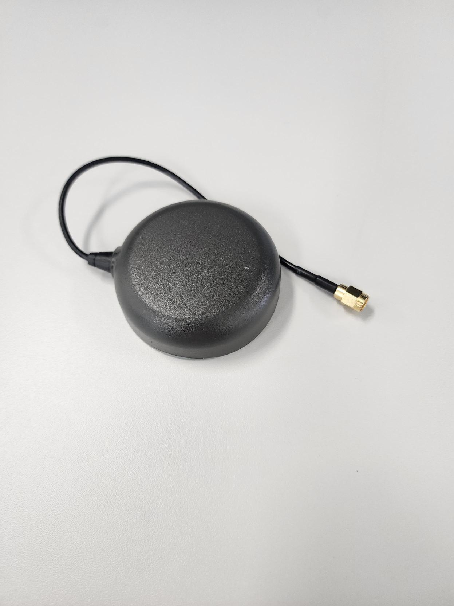

**NOTE**: The VANT (Antenna voltage) pad of mosaic-G5 module is directly connected to the external +5V pin. The internal bias control circuit detects overcurrent
conditions (>150mA) and protects the module in case of short circuit. According to mosaic-G5 hardware manual, VANT accepts 3V to 5.5V power supply.

When using the external power supply, make sure it is not more than 5V. Supplying higher voltages to VANT could **DAMAGE** the module.

#### Single/Dual Antenna Mode

The receiver can operate in either **single-antenna** or **dual-antenna** mode. Changing the frontend mode only takes effect after a reboot.

**Single-antenna mode**

* Run:

  ```
  setFrontendMode, SingleAnt
  ```
* to configure the receiver for single-antenna mode at the next reboot.

  Then save the configuration:

  ```
  exeCopyConfigFile, Current, Boot
  ```

* Finally, reboot the receiver:

  ```
  exeResetReceiver, Hard, none
  ```

**Dual-antenna mode**
* Run:

  ```
  setFrontendMode, DualAnt
  ```
* to configure the receiver for dual-antenna mode at the next reboot.

  Then save the configuration:

  ```
  exeCopyConfigFile, Current, Boot
  ```
* Finally, reboot the receiver:

  ```
  exeResetReceiver, Hard, none
  ```
P3H, P6 and P8 can run both in single or dual mode deppending on how you configure it. connect both the antenner connectors when using dual mode. 

#### Heading

You can use mosaic-G5 P3H for heading but **it's necessary to connect the two antenna connectors.** 

RxTools can be used to monitor the heading.

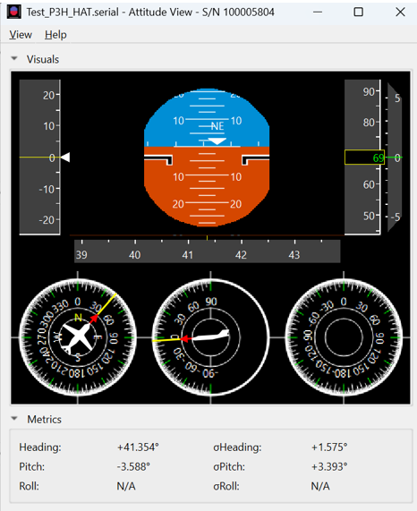

### USB communication

The mosaicG5 HAT via USB provides 2 USB serial ports that can be used with [Septentrio's RxTools](https://www.septentrio.com/en/products/gps-gnss-receiver-software/rxtools?__cf_chl_f_tk=9FZ303SoP8.kFwcI0yDpIdeAKHOC4U8.QrWtEdxvYuM-1783077901-1.0.1.1-mCYy7N0I0ynlIXaYiBgby9w0JgOXAPiThTtNe7ESnbY#resources).

Septentrio's RxTools is a Software which can be used to communicate to the mosaic-G5 HAT and can be downloaded free of charge from the [Septentrio support site](https://www.septentrio.com/en/products/gps-gnss-receiver-software/rxtools#resources). Once you have downloaded it you can use Septentrio's RxControl and Data Link which can communicate with the receiver over a serial-port connection: select Serial Connection option when opening the connection to the receiver.

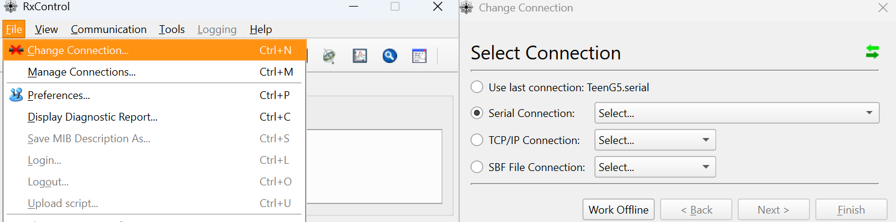

**NOTE:** That currently there's no RxTools release for RPi (ARM architecture). Thus, RxTools should be used on a regular PC.

### Serial communication
A simple way to communicate with the mosaic-G5 receiver is to connect one of the UART, it offers 2 UARTs connections.

* Both UART connections are  connected to the Raspberry-Pi for easie integration.

### FTDI-connector
An extra serial port is made available and can be used as an FTDI. FTDI can also be used with some Bluetooth devices. There is a large variety of FTDI devices which can help in communicating with the mosaicG5 HAT.

* The UART2 connection of the mosaic is exposed via pin header on the board. This can be usuable to connect an FTDI converter(eg. serial to Bluetooth or TLL to RS232 converter)

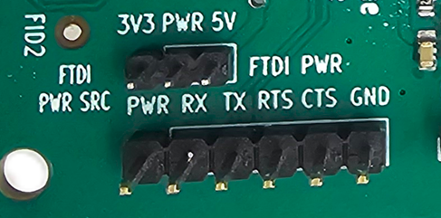

TTL to USB connection

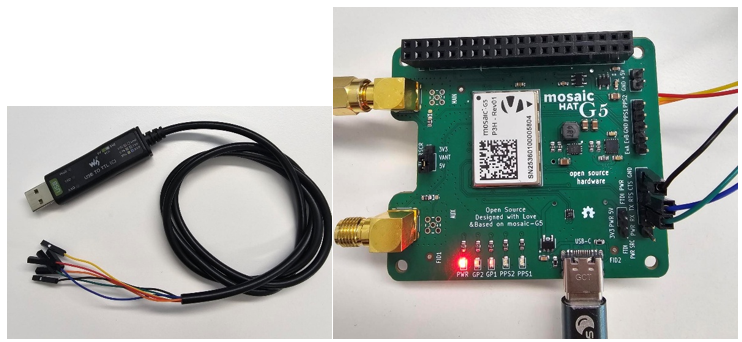

Serial connection of mosaicG5 HAT could be tested using PuTTY

Default COM-Port settings are:
|Parameter     |Value         |
|--------------|--------------|
|baud rate     | 115200     |   
|data bits | 8   |
|parity    |no    |
|stop bits | 1    |
|flow control | none|

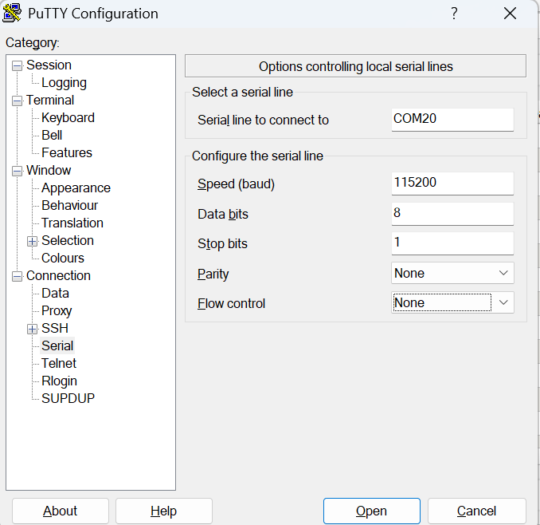

Can use comment ```sno, Stream1, COM2, GGA, sec1``` to output GGA data on the UART2

### LED indicators
The follwing LEDs are defined on the mosaicHAT

|**LED**  |**Description**   |
|-------|-------|
|PWR    | Board State (ON/OFF)  |
|GL1    | Conected to mosaic-G5 and RPi GPIO1  |
|GL2 | Connected to mosaic-G5 and RPi GPIO26   |
|PPS2 | Pulse Per Second  |
|PPS1 | Pulse Per Second  |

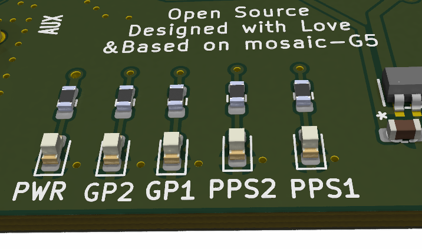

PPSO clock could be tuned using **setPPSParameters** command. While GPLEDs default mode is PVTLED, it could be configured to work in different modes (PVTLED, DIFFCORLED and TRACKLED) using setLEDMode command. Refer to the Hardware Manual for blinking behaviour of each mode. Both General Purpose LEDs (GL1 and GL2) could be directly controlled by Raspberry Pi GPIO.

Just for illustration, the following python script runs GL1 and GL2  together with the GNSS code. When there is no GNSS data GL1 will turn on and when there is GNSS data GL2 will turn on.

Find the code [here](/Python%20code/MG5_RPI_LED_code.py)

### Reset mosaic-G5

mosaic-G5 could be forced to reset from Raspberry Pi. The RST_IN pin of mosaic-G5 is directly connected to RPi GPIO 17 (Pin 11 in physical header).

The RST_IN pin is active negative, which means mosaic will be in RESET mode when RST_IN is low (GND). The pin is internally debounced (pull-up) so if pin is left unconnected (floating) the module will not enter RESET mode.

Initially, the RPi GPIO pins are set to INPUT mode. As the RPi input line have high impedance, RST_IN will be floating. This means mosaicHAT board could run without issues initially even if GPIO 17 is not set to HIGH (while kept in input mode). However, it is not recommended to rely on the GPIO initial state. Users should drive HIGH to GPIO 17 for the stability of their applications.

To reset module, a LOW pulse, not shorter than 1 microsecond, should be driven to GPIO 17.

### PPS output

PPS signals are used for precise timekeeping and time measurement. One increasingly common use is in time synchronization with other sensors (e.g. Lidars or IMUs).

The receiver is able to generate an x-pulse-per-second (xPPS) signal aligned with GPS, Galileo, GLONASS system time, UTC, or with the internal receiver time (RxClock). 

Polarity, frequency and pulse width of PPSO could be configured by **setPPSParameters** command.

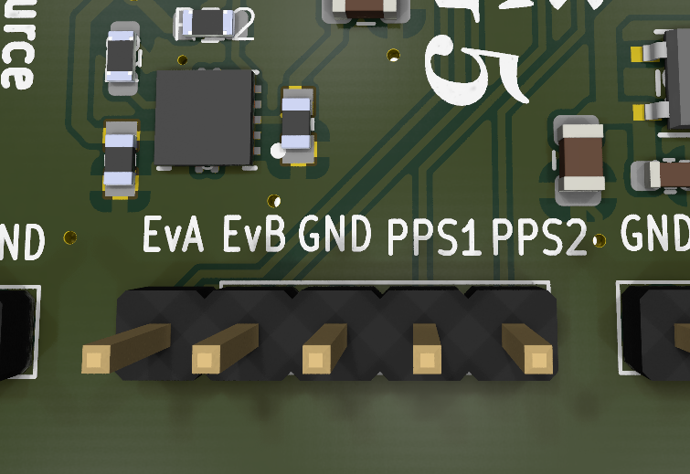

By default, **PPSO2 is disabled**. It can be enabled and configured in **RxControl**:.

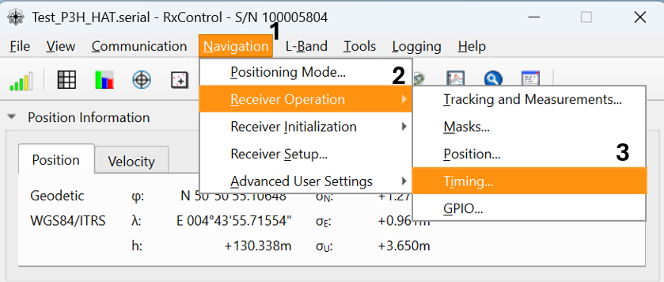


Both PPS Output operate at 3.3 V logic levels. PPSO1 and PPSO2 are directly connected to an indicator LED. 

More information on the definition of PPS output or on how to configure the PPS parameters can be found in the mosaic-G5 reference guide. You can download this one from [Septentrio site](https://www.septentrio.com/en/products/gnss-receivers/gnss-receiver-modules/mosaic-G5-P3H).

### Events
EVENTs could be tested directly on mosaicG5 HAT board by connecting PPS Output to one of the EVENTs pins. Note that this works with a single wire because they share the same GND. Here PPSO_1 is connected to EVENTB, with PPS interval set to 1 sec.

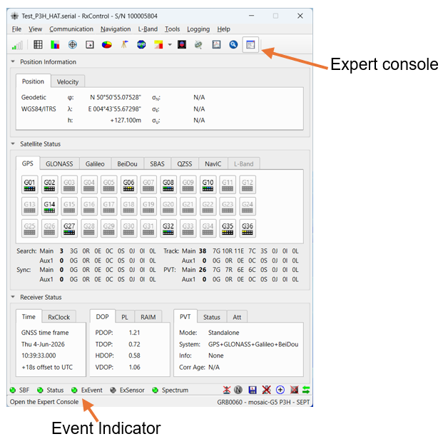
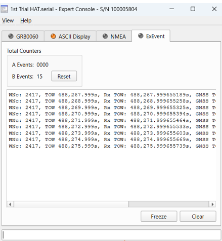

To monitor Events you could use Rxcontrol, clicking on the expert console. once you have connected an output to the event pin you will see the data being recieved on the pin.

**Note:** The **EVENT** inputs use **3.3 V logic levels**. Applying higher voltages may damage the receiver.

For more information about the EVENT input functionality, see the **mosaic-G5 Reference Guide**, available from the [Septentrio website](https://www.septentrio.com/en/products/gnss-receivers/gnss-receiver-modules/mosaic-G5-P3H).

### Python script

Find the full code [here](/Python%20code/MG5_RPI_code.py)
```
import serial   # Library used for UART / serial communication
import time     # Library used for implementing timing delays

# Establish UART serial connection to the GNSS receiver
serial_port = serial.Serial('/dev/serial0', 115200)

# /dev/serial0 refers to the primary Raspberry Pi UART interface
# 115200 baud is the default communication speed of the mosaic-G5 receiver

# If using USB serial communication instead of UART, the device may appear as:
# /dev/ttyACM0, /dev/ttyACM1, etc.
# Available serial devices can be checked using:
# dmesg | grep tty

# If permission errors occur when accessing USB serial ports, run:
# sudo chmod 666 /dev/ttyACM0

time.sleep(1) # delay for serial connection time to be initialise properly

serial_port.write(b'SSSSSSSSSSSSS\n') # Send multiple 'S' characters to place the mosaic-G5 into command mode

time.sleep(0.1) # Short delay to ensure the command is processed

# Enable continuous NMEA GGA message streaming once per second on COM1
# For USB communication, replace COM1 with USB1 or USB2
serial_port.write(b'sno, Stream1, COM1, GGA, sec1\n')

time.sleep(0.1) # delay for reading incoming serial data

while True:
  
    nmea_data_bytes = serial_port.readline()          # Read one complete line of incoming serial data from the receiver   
    nmea_sentence = str(nmea_data_bytes.decode())      # Decode received byte data into a UTF-8 string    
    nmea_sentence = nmea_sentence.rstrip()            # Remove newline and whitespace characters

    # Check if the received NMEA sentence is a GNGGA position message
    if (nmea_sentence.startswith('$GNGGA')):
       
        nmea_fields = [element.strip() for element in nmea_sentence.split(',')]      #separated NMEA fields with a comma into a list
       
        quality_indicator = int(nmea_fields[6])                                      #Get the NMEA quality indicator field
       
        if quality_indicator==0:                    # Quality indicator value of 0 means no valid GNSS position fix

            print("No GPS Fix Available!")

        else:
            utc_time = float(nmea_fields[1])                 # Parse UTC time field from the NMEA GGA message
            latitude = float(nmea_fields[2])*0.01            # Get latitude value in NMEA format
            latitude_direction = nmea_fields[3]             # Get latitude hemisphere indicator (N or S)
            longitude = float(nmea_fields[4])*0.01           # Get longitude value in NMEA format
            longitude_direction = nmea_fields[5]             # Get longitude hemisphere indicator (E or W)
            altitude = float(nmea_fields[9])                  # Get altitude above mean sea level           
            altitude_unit = nmea_fields[10]                  # Get altitude unit, typically metres (M)

            # Display parsed GNSS positioning information
            print('UTC Time: ' + str(utc_time))
            print(' Latitude: ' + str(latitude) + latitude_direction)
            print(' Longitude: ' + str(longitude) + longitude_direction)
            print(' Height: ' + str(altitude) + altitude_unit)  

        # Delay before processing the next incoming message
        time.sleep(0.1)
    else:
        continue         # Ignore non-GGA NMEA messages and continue listening
serial_port.close()     # Close serial connection when the program terminates

```

When you connect to the second UART change **COM1** to **COM2** 

```serial_port.write(b'sno, Stream1, COM2, GGA, sec1\n')```
and the serial port should be:

```serial_port = serial.Serial('/dev/ttyAMA3', 115200)```


