# mosaicG5 HAT

|mosaicG5 HAT| A GNSS HAT fOr Raspberry Pi|
|------|-------|
|Author|  [laekaz](https://github.com/laekaz)|
|Maintainer| [(Septentrio gnss github user)](githubuser@septentrio.com)|
|external website| https://github.com/septentrio-gnss/mosaicG5-HAT  |
|License| [CC BY-SA 4.0](https://creativecommons.org/licenses/by-sa/4.0/) and [open source](https://www.oshwa.org/definition/) |
|Avalable to purchase here:| |

## Table of Content

## Introduction to mosaicG5 HAT
### What is the mosaicG5 HAT?
The mosaicG5 HAT is an add-on board that brings high-precision GNSS (GPS) which integrates [mosaic-G5](https://www.septentrio.com/en/products/gnss-receivers/gnss-receiver-modules) Septentrio's GNSS module with basic communications, allowing the system to receive signals from multiple GNSS constellations, such as GPS, Galileo, GLONASS, and BeiDo. 
The goal of the design is to allow easy hardware prototyping and integration of the mosaic-G5 taking advantage of the computer ecosystem provided by the Raspberry pi environment.

The board can also operate as a standalone device when powered through its USB connector or external power input pins.

### A HAT for Raspberry Pi?
HAT stands for *Hardware Attached on Top*. It is a type of add-on board specifically designed to sit on top of a Raspberry Pi and connect directly to its 40-pin GPIO header. HATs follow certain standards so they fit neatly, communicate properly, and are powered safely from the Pi.

#### Robust Mechanical Design

Four dedicated mounting holes provide a secure and rigid connection between the Raspberry Pi and the add-on board.

### Can I buy it?

#### Produce yourself
You can use the design files, Bill of Materials from this project and contact your manufacturing company for production. In this project we used JLCPCB for producing the PCB and assembling it. We used JLCPCB for PCB fabrication and assembly because of its competitive pricing and component availability.

##### Do I need to source special components for producing this board?

Yes, Some components are not available through JLCPCB's standard parts library and must be supplied separately. however, if you are assembling the PCB by yourself, all components are available on DigiKey and clearly listed in the project's Bill of Materials. The mosaic GNSS module can be obtained from Digikey or directly from Septentrio. For larger production volumes, we recommend contacting the Septentrio sales team directly at [Septentrio Contact Page](https://www.septentrio.com/en/contact/ask-question)

### What is a mosaic-G5 module?
The mosaic-G5 is a compact GNSS receiver from Septentrio, engineered for high reliability and precise positioning. It integrates the latest multi-band, multi-constellation GNSS technology, providing accurate positions while minimizing power consumption. The receiver can access signals from all major GNSS constellations, including GPS, Galileo, GLONASS, and BeiDou.

#### Other mosaic-G5 versions
Different versions of the mosaic-G5 are available to suit various applications, as summarized below:

| Features     | [mosaic-G5 P1](https://www.septentrio.com/en/products/gnss-receivers/gnss-receiver-modules/mosaic-g5-p1) | [mosaic-G5 P3](https://www.septentrio.com/en/products/gnss-receivers/gnss-receiver-modules/mosaic-G5-P3) | [mosaic-G5 P3H](https://www.septentrio.com/en/products/gnss-receivers/gnss-receiver-modules/mosaic-G5-P3H) |[mosaic-G5 P6](https://www.septentrio.com/en/products/gnss-receivers/gnss-receiver-modules/mosaic-G5-P6) | [mosaic-G5 P8](https://www.septentrio.com/en/products/gnss-receivers/gnss-receiver-modules/mosaic-g5-p8) |
|--------------|--------------|--------------|---------------|---------------|---------------|
| Functionality|High-precision positioning   |High-precision positioning |Positioning + Heading|Positioning + Heading | Positioning + Heading|
| Use case     |Robotics (e.g robotic mowers), GIS devices |UAV, Commercial mowers, Industrial Robotics, Survey, Marine navigation | Marine navigation, Machine control, Autonomous vehicles,  Survey | Autonomous vehicles, Marine navigation, Machine control, Survey | High-end autonomous systems, Robotics, Marine navigation, Survey, Machine control |          
| GNSS bands   | Triple-band  | Quad-band    | Quad-band     |Quad-band |Quad-band  |
| RTK support  | Yes          | Yes          | Yes           |Yes       |Yes        |
| Dual antenna |    No        |  No          | Yes           |Yes       |Yes        |
| Heading      |     NO       |   No         | Yes           |Yes       |Yes        |


### Who is Septentrio?


Septentrio is a leading company that designs, manufactures and sells high precision and multi-frequency GPS/GNSS receivers for demanding applications. Septentrio products are used in different industries including automotive, marine, construction, rail, machine control, logistics, precision agriculture, geographic information systems (GIS), Unmanned aerial vehicles (UAVs), surveying, mapping and scientific development. Septentrio’s receivers constantly deliver accurate and precise GNSS positioning scalable to centimetre-level and designed to perform perfectly in challenging environments. 

Septentrio's technology offers high accuracy and reliability thanks to advanced GNSS signal-processing algorithms as well as [Advanced interference Monitoring and Mitigation (AIM+)](https://www.septentrio.com/en/learn-more/advanced-positioning-technology/aim-anti-jamming-protection) This protects your application against jamming (RF interference) and spoofing (malicious attacks).

For more information about Septentrio products go to [**https://www.septentrio.com/**](https://web.septentrio.com/GH-SSN-home).

### Deliverables
|Files         |Description   |
|--------------|--------------|
|  [mosaicG5_RPi_HAT.kicad_pro](./Kicad/mosaicG5%20HAT/mosaicG5_RPi_HAT.kicad_pro)   |KiCad project |
| [mosaicG5_RPi_HAT.kicad_pcb](./Kicad/mosaicG5%20HAT/mosaicG5_RPi_HAT.kicad_pcb) | KiCad layout |
|  [mosaicG5_RPi_HAT.kicad_sch](./Kicad/mosaicG5%20HAT/mosaicG5_RPi_HAT.kicad_sch)  |KiCad schematic |
|    | Project schematic library |
|    |mosaic symbol |
|    |mosaic footprint |
|    | mosaicG5 HAT Bill of Materials |
### Is the project open-source?
Yes, We made this open source so you can tinker, adapt, and create. If you are building your own robotics project, a spin-off device, or integrating GNSS into a larger system, this is a great starting point.

Open source here means:
* All files fully editable
* Freedom to modify, remix, and innovate
* You can sell your version. No -NC limitations
* May require attribution
* Build on our work, push it further, and even make money doing it

More info about licensing can be found here: 

## Disclaimer
This project is offered as-is. The main interfaces have been tested, but the design has not been fully checked or approved by the author or Septentrio. You are responsible for how you use it in your own projects. For guidance on working with Septentrio’s GNSS mosaic modules, we suggest reaching out to Septentrio directly.

Support website: https://www.septentrio.com/en/support
### Documentation sections
This project contains two important sections for documentation. The first one which is a user documentation; see section [mosaicG5 HAT user documentation](#mosaicg5-hat-user-documentationm) and the second one; see section [mosaicG5 HAT Design Documentation](#mosaicg5-hat-design-documentation) which is a documentation for designers who want to modify the reference design of this project.

## mosaicG5 HAT user documentation

### mosaicG5 HAT Manufacturing and Assembly
#### Elements to provide when manufacturing the board
When you manufacture your board they will ask you for the following parts:

For the PCB only:
* The PCB design, you will need to export gerber and drill files 

For assembly:

* Bill of Materials (BOM), the list of components used in the project with their reference designators. For this project check [BOM]().
* Component Placement List (CPL), this file contains the exact position of each component on the board (X,Y and rotation). CPL is exported from KiCad however, you need to check with the manufacturer services to ensure the right placement for components.

#### Ordering mosaic module
You can order the mosaic-G5 from Digi-Key, or you can contact Septentrio at www.septentrio.com for purchasing inquiries or other mosaic models.

| mosaic-G5 versions | Septentrio | Digi-Key part_number|
|-----------------|------------|--------|
| mosaic-G5 P1 |[Septentrio_G5-P1](https://www.septentrio.com/en/products/gnss-receivers/gnss-receiver-modules/mosaic-g5-p1) | - |
| mosaic-G5 P3 | [Septentrio_G5-P3](https://www.septentrio.com/en/products/gnss-receivers/gnss-receiver-modules/mosaic-G5-P3) | [410501](https://www.digikey.com/en/products/detail/septentrio-inc/410501/28527327) |
| mosaic-G5 P3H |[Septentrio_G5-P3H](https://www.septentrio.com/en/products/gnss-receivers/gnss-receiver-modules/mosaic-G5-P3H) | [410502](https://www.digikey.com/en/products/detail/septentrio-inc/410502/28527213) |
| mosaic-G5 P6 |[Septentrio_G5-P6](https://www.septentrio.com/en/products/gnss-receivers/gnss-receiver-modules/mosaic-G5-P6) | [410503]() |
| mosaic-G5 P8 |[Septentrio_G5-P8](https://www.septentrio.com/en/products/gnss-receivers/gnss-receiver-modules/mosaic-g5-p8) | [410610]() |

### General interfaces of mosaicHAT
The board exposes the following interfaces:


### Connecting to Raspberry Pi
mosaicG5 HAT can be easily attached to Raspberry Pi as shown here:

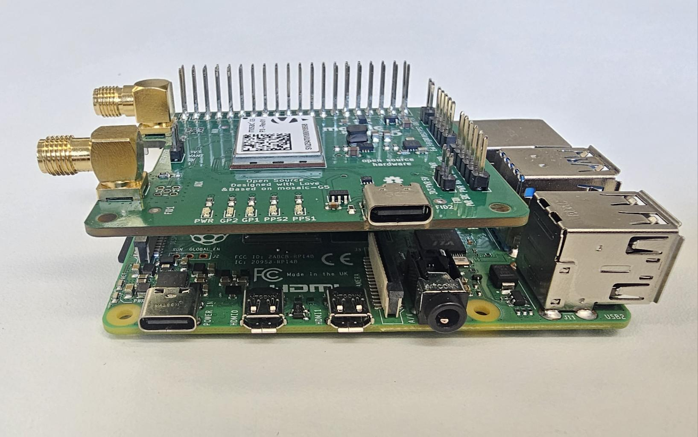
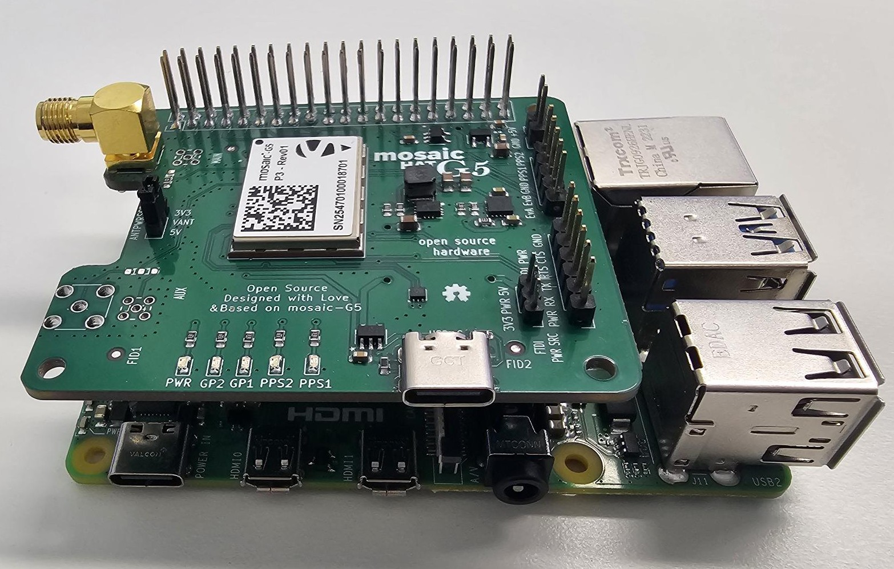

#### Preparing Raspberry Pi
To enable communication between mosaicG5 HAT and Raspberry Pi (RPi), you should make sure required serial communication settings are configured.

Raspberry Pi OS
* To enable RPi serial communication, go to terminal and run:

```sudo raspi-config```

* Select **Interfacing Options**, then from the menu select Serial Port.
You will get the question:
would you like a login shell to be accessible over serial?
select **No**. Another prompt will ask:
would you like serial port hardware to be enabled?
select **Yes**.

* Reboot the Raspberry Pi for the changes to take effect.

```sudo reboot```

* After reboot check UART devices

```ls -l /dev/serial* ```

The output should be similar to:

```/dev/serial0 -> ttyAMA0```

```/dev/serial1 -> ttyS0```

On the RPi 4 
serial0 maps to GPIO 14 and 15 which are connected to UART1 of the mosaic-G5. 

To communicate with UART1, use:

```/dev/serial0```

#### connecting to antenna

In order to benefit from the multiple signals and constellations that the mosaicG5 HAT board has it is recommended to purchase a capable multiband antenna. There are several GNSS antenna manufacturers in the market (e.g. Maxtenna, Tallysman, etc). For more information you can also contact Septentrio.

There are also different antenna types each suitable for different applications (e.g. robotics, larger machines, etc).Generally, the larger the antenna the better performance you might get, however it is not all about size but also the quality of the antenna elements.

For testing the board we used Tallysman antenna:


Note: The VANT (Antenna voltage) pad of mosaic module is directly connected to the external +5V pin. The internal bias control circuit detects overcurrent
conditions (>150mA) and protects the module in case of short circuit. According to mosaic hardware manual, VANT accepts 3V to 5.5V supply.

When using the external power supply, make sure it is not more than 5V. If more than 5V source is desired, make sure the two PWR jumpers are connected to 3V3 pin, or removed. Supplying higher voltages to VANT could DAMAGE the module.

#### USB communication
#### Serial communication
A simple way to communicate with the mosaic-G5 receiver is to connect one of the UART, it offers 2 UARTs connections.

* Both UART connections are  connected to the Raspberry-Pi for easie integration.

#### RxTools

Septentrio's RxTools is a Software which can be used to communicate to the mosaicHAT and can be downloaded free of charge from the [Septentrio support site](https://www.septentrio.com/en/products/gps-gnss-receiver-software/rxtools#resources). Once you have downloaded it you can use Septentrio's RxControl and Data Link which can communicate with the receiver over a COM-port connection: select Serial Connection option when opening the connection to the receiver.

Note that currently there's no RxTools release for RPi (ARM architecture). Thus, RxTools should be used on a regular PC.

#### FTDI-connector
An extra serial port is made available and can be used as an FTDI. FTDI can also be used with some Bluetooth devices. There is a large variety of FTDI devices which can help in communicating with the mosaic G5 HAT.

* The UART2 connection of the mosaic is exposed via pin header on the board. This can be usuable to connect an FTDI converter(eg. serial to Bluetooth or TLL to RS232 converter)


TTL to USB connection


Serial connection of mosaic G5 HAT could be tested using PuTTY

Default COM-Port settings are:
|Parameter     |Value         |
|--------------|--------------|
|baud rate     | 115200     |   
|data bits | 8   |
|parity    |no    |
|stop bits | 1    |
|flow control | none|


Can use comment ```sno, Stream1, COM2, GGA, sec1``` to output GGA data on the UART2

#### LED indicators
The follwing LEDs are defined on the mosaicHAT

|**LED**  |**Description**   |
|-------|-------|
|PWR    | Board State (ON/OFF)  |
|GL1    | Conected to mosaic G5 and RPi GPIO1  |
|GL2 | Connected to mosaic-G5 and RPi GPIO26   |
|PPS2 | Pulse Per Second  |
|PPS1 | Pulse Per Second  |


PPSO clock could be tuned using **setPPSParameters** command. While GPLEDs default mode is PVTLED, it could be configured to work in different modes (PVTLED, DIFFCORLED and TRACKLED) using setLEDMode command. Refer to the Hardware Manual for blinking behaviour of each mode. Both General Purpose LEDs (GL1 and GL2) could be directly controlled by Raspberry Pi GPIO.

Just for illustration, the following python script runs GL1 and GL2 in alternate blinking mode. It is up to users to customize those LEDs as convenient for their applications.

```
import RPi.GPIO as GPIO # Import Raspberry Pi GPIO library
from time import sleep # Import the sleep function from the time module

GPIO.setwarnings(False) # Ignore warning for now
GPIO.setmode(GPIO.BCM) # Use BCM pin numbering

# Set pins 6 &26 to be output pins and set their initial values to low (off)
GPIO.setup(26, GPIO.OUT, initial=GPIO.LOW) 
GPIO.setup(6, GPIO.OUT, initial=GPIO.LOW) 

while True: # Run forever
 GPIO.output(26, GPIO.HIGH) # Turn 26 on
 GPIO.output(6, GPIO.LOW) # Turn 26 off
 sleep(1) # Sleep for 1 second
 GPIO.output(26, GPIO.LOW) # Turn 26 off
 GPIO.output(6, GPIO.HIGH) # Turn 6 on
 sleep(1) # Sleep for 1 second
 ```


#### Reset mosaic-G5

mosaic-G5 could be forced to reset from Raspberry Pi. The RST_IN pin of mosaic-G5 is directly connected to RPi GPIO 17 (Pin 11 in physical header).

The RST_IN pin is active negative, which means mosaic will be in RESET mode when RST_IN is low (GND). The pin is internally debounced (pull-up) so if pin is left unconnected (floating) the module will not enter RESET mode.

Initially, the RPi GPIO pins are set to INPUT mode. As the RPi input line have high impedance, RST_IN will be floating. This means mosaicHAT board could run without issues initially even if GPIO 17 is not set to HIGH (while kept in input mode). However, it is not recommended to rely on the GPIO initial state. Users should drive HIGH to GPIO 17 for the stability of their applications.

To reset module, a LOW pulse, not shorter than 1 microsecond, should be driven to GPIO 17.

#### PPS output

PPS signals are used for precise timekeeping and time measurement. One increasingly common use is in time synchronization with other sensors (e.g. Lidars or IMUs).

The receiver is able to generate an x-pulse-per-second (xPPS) signal aligned with either GPS, Galileo or GLONASS system time, or with UTC, or with the internal receiver time (RxClock). 

Polarity, frequency and pulse width of PPSO could be configured by **setPPSParameters** command.


Both PPS Output runs on 3.3V level. PPSO1 and PPSO2 are directly connected to an indicator LED. 

More information on the definition of PPS output or on how to configure the PPS parameters can be found in the mosaic-G5 reference guide. You can download this one from [Septentrio site](https://www.septentrio.com/en/products/gnss-receivers/gnss-receiver-modules/mosaic-G5-P3H).

#### Events
EVENTs could be tested directly on mosaicG5 HAT board by connecting PPS Output to one of the EVENTs pins. Note that this works with a single wire because they share the same GND. Here PPSO_1 is connected to EVENTA, with PPS interval set to 1 sec.

To monitor Events you could use Rxcontrol, clicking on the expert console. once you have connected an output to the even pin you will see the data being recieved on the pin.


#### Python script

```
import serial   # Library used for UART / serial communication
import time     # Library used for implementing timing delays

# Establish UART serial connection to the GNSS receiver
serial_port = serial.Serial('/dev/serial0', 115200)

# /dev/serial0 refers to the primary Raspberry Pi UART interface
# 115200 baud is the default communication speed of the mosaic-G5 receiver

# If using USB serial communication instead of UART, the device may appear as:
# /dev/ttyACM0, /dev/ttyACM1, etc.
# Available serial devices can be checked using:
# dmesg | grep tty

# If permission errors occur when accessing USB serial ports, run:
# sudo chmod 666 /dev/ttyACM0

time.sleep(1) # delay for serial connection time to be initialise properly

serial_port.write(b'SSSSSSSSSSSSS\n') # Send multiple 'S' characters to place the mosaic-G5 into command mode

time.sleep(0.1) # Short delay to ensure the command is processed

# Enable continuous NMEA GGA message streaming once per second on COM1
# For USB communication, replace COM1 with USB1 or USB2
serial_port.write(b'sno, Stream1, COM1, GGA, sec1\n')

time.sleep(0.1) # delay for reading incoming serial data

while True:
  
    nmea_data_bytes = serial_port.readline()          # Read one complete line of incoming serial data from the receiver   
    nmea_sentence = str(nmea_data_bytes.decode())      # Decode received byte data into a UTF-8 string    
    nmea_sentence = nmea_sentence.rstrip()            # Remove newline and whitespace characters

    # Check if the received NMEA sentence is a GNGGA position message
    if (nmea_sentence.startswith('$GNGGA')):
       
        nmea_fields = [element.strip() for element in nmea_sentence.split(',')]      #separated NMEA fields with a comma into a list
       
        quality_indicator = int(nmea_fields[6])                                      #Get the NMEA quality indicator field
       
        if quality_indicator==0:                    # Quality indicator value of 0 means no valid GNSS position fix

            print("No GPS Fix Available!")

        else:
            utc_time = float(nmea_fields[1])                 # Parse UTC time field from the NMEA GGA message
            latitude = float(nmea_fields[2])*0.01            # Get latitude value in NMEA format
            latitude_direction = nmea_fields[3]             # Get latitude hemisphere indicator (N or S)
            longitude = float(nmea_fields[4])*0.01           # Get longitude value in NMEA format
            longitude_direction = nmea_fields[5]             # Get longitude hemisphere indicator (E or W)
            altitude = float(nmea_fields[9])                  # Get altitude above mean sea level           
            altitude_unit = nmea_fields[10]                  # Get altitude unit, typically metres (M)

            # Display parsed GNSS positioning information
            print('UTC Time: ' + str(utc_time))
            print(' Latitude: ' + str(latitude) + latitude_direction)
            print(' Longitude: ' + str(longitude) + longitude_direction)
            print(' Height: ' + str(altitude) + altitude_unit)  

        # Delay before processing the next incoming message
        time.sleep(0.1)
    else:
        continue         # Ignore non-GGA NMEA messages and continue listening
serial_port.close()     # Close serial connection when the program terminates

```


## mosaicG5 HAT Design Documentation
This section describes the design principles and architecture of the mosaicG5 HAT in depth.

### Design Overview

The mosaicG5 HAT is a four-layer Printed Circuit Board (PCB) designed to mount directly onto a Raspberry Pi. The top and bottom layers are used for both signal and power routing. The first internal layer serves as a ground (GND) plane, while the second internal layer is primarily used as a 3.3 V power plane, with limited routing for additional connections where required.

With the exception of the Raspberry Pi female header connector, all components are mounted on the top side of the board. The design uses Surface-Mount Devices (SMDs) throughout, except for the external connectors.

The mosaicG5 HAT was developed using [KiCad], an open-source Electronic Design Automation (EDA) suite. In addition to its schematic capture and PCB layout capabilities, KiCad includes an integrated 3D viewer that provides a realistic representation of the assembled board.

The schematic diagram is shown below. For improved readability and access to complete design details, refer to the PDF version of the [schematic].


The board layout without the copper pour. 


The board layout with the copper pour


Layout layer descriptions:

|Layer|Description|
|--------|----------|
|Layer 1| Red traces, copper pour connected to GND |
|Layer 2| Solid GND plane |
|Layer 3| Orange traces, copper pour connected to 3.3 V |
|Layer 4| Blue traces, copper pour connected to GND|

A top 3D view of the mosaicG5 HAT, featuring main electronic components.


### mosaic pinout
The Septentrio mosaic-G5 is the core of the mosaicG5 HAT board. It is a 22.8 x 16.4 mm compact GNSS module of 94 pins with a weight of 2.2 g. Complete information on mosaic-G5 connections can be found in the [Hardware Manual](https://www.septentrio.com/en/products/gnss-receivers/gnss-receiver-modules/mosaic-G5-P3H).


The symbol, footprint and 3D model of mosaic-G5 can be found [here]()


### power sources

The mosaicG5 HAT has 3 options for powering the board; Raspberry Pi, USB-C and external power pin headers. The mosaic-G5 module itself runs on 3.3V, thus a buck converter(MP2145GD-Z) is used to regulate the voltage from 5V to 3.6V and an LDO voltage regulator is used to filter the switching noise from the buck converter and to regulate the voltage from 3.6 to 3.3volts(TPS7A9401DSCR). Raspberry Pi and USB-C already provide 5V.

    **NOTE:**
   When using the external power connector, only 5 V should be applied.

    **WARNING:**
    Applying voltages higher than 5 V to the external power input or higher than the specified voltage to **VANT** may damage the module

The ideal diodes (**XC8111AA01MR-G**) are used to ensure one-way current flow. Decoupling capacitors (1 µF) are used according to regulator’s datasheet. The following figure shows the power section of the schematic.

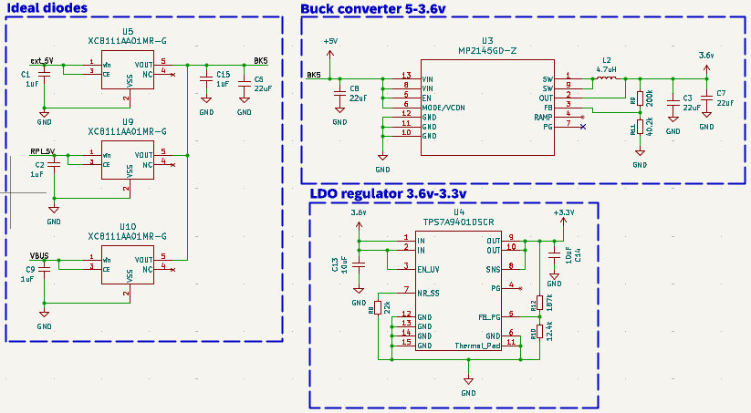


In the figure above:
1. Buck converter(MP2145GD-Z).
2. Voltage regulator (TPS7A9401DSCR).
3. Raspberry Pi power source (5V pins).
4. External power source headers.
5. Micro USB power source.

### antennas 
The mosaic-G5 P3H is a dual-antenna while the mosaic-G5 P3 is a single-antenna both of these modules are compatible with the PCB board however, when connecting the mosaic-G5 P3 you only connect the main antenna connector and leave the auxiliary unconnected. Both the antenna pins are not ESD-protected or biased in the schematics because all is done in the module. 

The following figure shows the antenna section of the schematic.


#### antenna connectors

The PCB includes footprints for both SMA and U.FL antenna connectors. When assembling the PCB you can choose the type of connector you are going to choose. You do that by assembling one of the resistor to select either antenna connector.mosaicG5 HAT user can choose between 3.3V and 5V supply for the antenna voltage(VANT) using 2.00 mm header jumpers.

#### First antenna

The first SMA antenna J10 is directly connected to a 0 ohm resistor and the first MMCX antenna J12 is also connected to a 0 ohm resistor and they are both connected to the main mosaic-G5 pin.
The DC voltage of the main antenna connection is supplied from the mosaic-G5's VANT pin.

The input impedance of the RF line is 50 Ohms. Thus, antenna trace should have a characteristic impedance (Zo) of 50 Ohms. To determine the proper impedance for the antenna traces for RF signal routing, calculations were performed with the [JLCPCB Impedance Calculator](https://jlcpcb.com/pcb-impedance-calculator)(recommended if you are using JLCPCB as manufacturer) or can use freeware [Saturn PCB toolkit](https://saturnpcb.com/pcb_toolkit). The trace parameters used in the calculation were based on the specifications of the selected PCB manufacturer. Calculations determined that a trace width of 0.1425 mm would provide an impedance of 50Ω to the RF antenna traces.

Having right characteristic impedance ensures reduced signal reflections in the opposite direction thus higher quality of signals. For uniform lines, characteristic impedance is dependent on trace length.

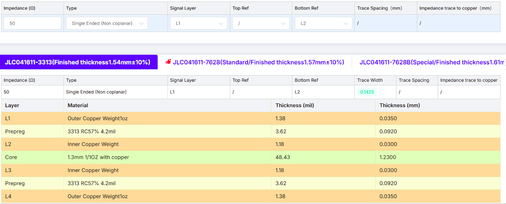

It is also important to stitch vias every few millimeters around the RF line for good ground coherence. Ground stitching vias help to protect line from interference.


For more details on antennas and interference please refer to mosaic-G5's [Hardware Manual](https://www.septentrio.com/en/products/gnss-receivers?f%5B0%5D=type%3A604).

#### second antenna

The second antenna is similar to the first antenna except when using a single antenna module like the mosaic-G5 P3, you do not need to assemble the the second antenna connector. 


### Raspberry pi serial

Serial communication between the mosaic-G5 and the Raspberry Pi is implemented by connecting UART1 and UART2 connections of mosaic-G5 to Raspberry Pi UART pins: TX (GPIO_14, GPIO_5) and RX (GPIO_15, GPIO_4). GPIO_14 and GPIO_5 are pin 8 and pin 29 respectively on the GPIO header whereas GPIO_15 and GPIO_4 are pin 10 and pin 7 respectively. The mosaic-G5's TX is connected to the Raspberry Pi's RX while RX is connected to Raspberry Pi's TX for both UARTs.


### Reset Input
The RST_IN pin of mosaic-G5 is directly connected to RPi GPIO 17 (Pin 11 in physical header). Refer to [Reset mosaic](#reset-mosaic-G5) in user documentation for more details.

### USB-C
To use mosaic-G5 as a USB device, the following pins of the module should be connected to a USB-C connector:


A common mode filter with ESD protection for USB 2.0 (ECMF02-2AMX6) is used with USB_DP (D+) and USB_DN (D-) for protection. The filter suppresses electromagnetic interference (EMI) on high-speed differential USB lines.

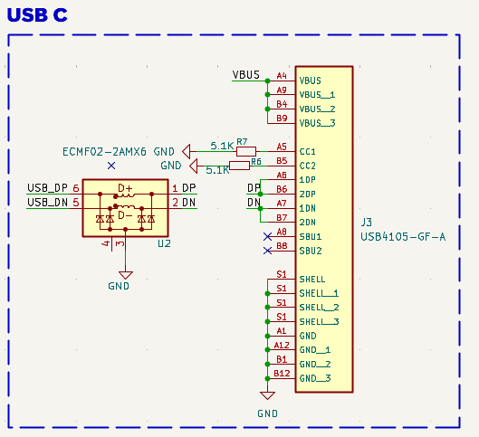

As USB uses a differential pair for data transmission, differential pair impedance (Zdifferential) should be tuned to avoid reflections. Zdifferential needs to be around 90 Ohms. The same [JLCPCB impedance calculator](https://jlcpcb.com/pcb-impedance-calculator) was used to determine the dimensions of the differential signal pair that will carry the USB signals. 

The parameters used for this calculation were the same as those used for the RF antenna traces: the materials, thickness of copper finish, and number of layers of the PCB manufacturer that was selected. The results of this calculation determined that a width of 0.1468 mm would provide the necessary impedance of 90 Ω to the differential signal pair. 

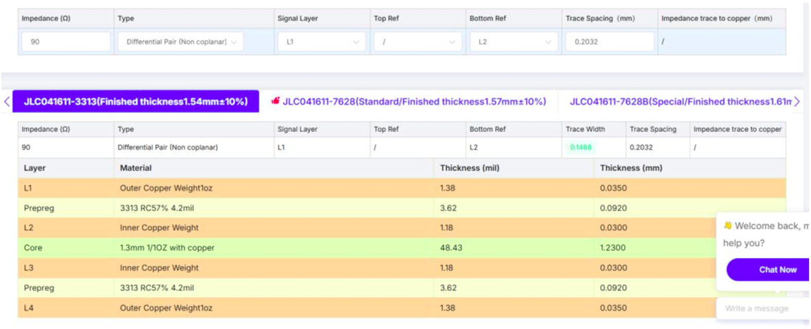

The following figure hights USB parts highlighted. GND vias were stitched around the USB connector and lines to ensure good ground coherence.

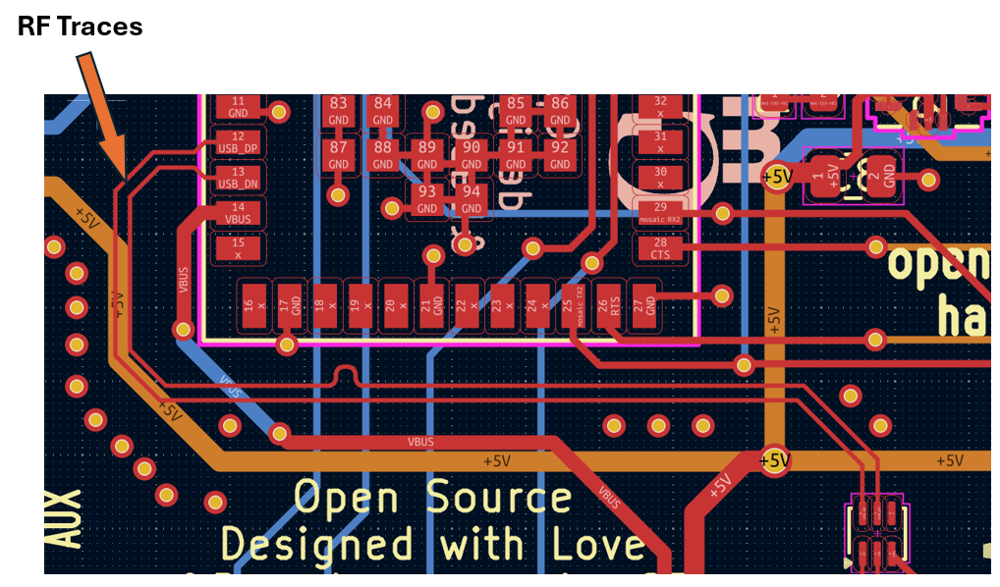

* USB-C connector (USB4105-GF-A).
* Common mode filter.
* USB D+/D- lines.
* VBUS.

### Events and PPSO


### FTDI
Second serial interface to mosaic-G5 (UART2) is exposed through 2.54 mm pin headers. The FTDI connection allows communication with other devices through serial (e.g. HC-06 Bluetooth module).

If the external device needs power supply from mosaicG5 HAT, like HC-06, VCC pin of FTDI could be used. 5V or 3.3V could be provided by moving the FTDI PWR SRC jumpers.

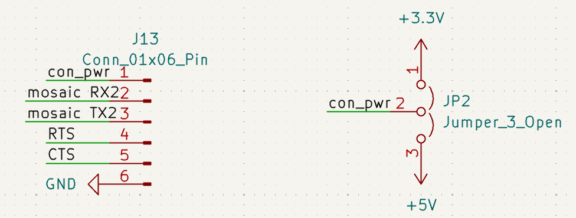

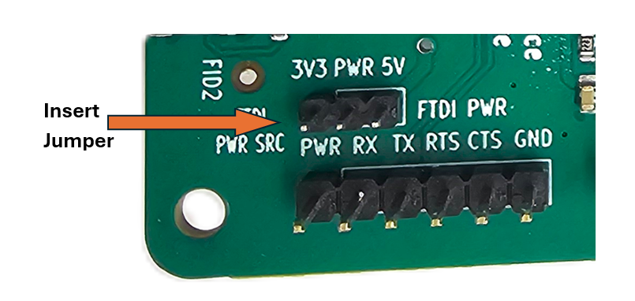

### LEDs

mosaicG5 HAT has five blue indicator LEDs.

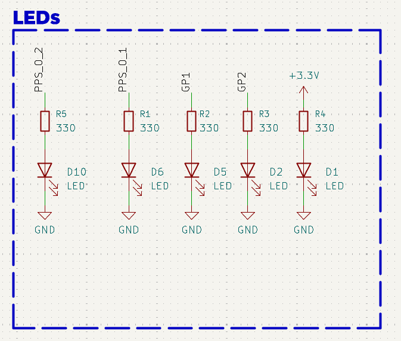

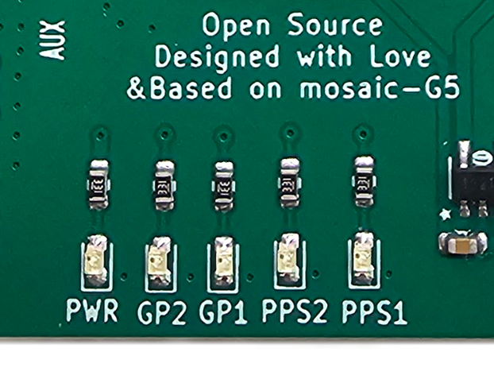


### Clock Frequency Reference
mosaic-G5 module embeds an internal Temperature Compensated Crystal Oscillator (TCXO) for frequency reference. The module can either use its internal TCXO frequency reference or an external frequency reference. In mosaicG5 HAT's case, internal reference is used.

Following are Hardware Manual instructions for using internal TCXO.

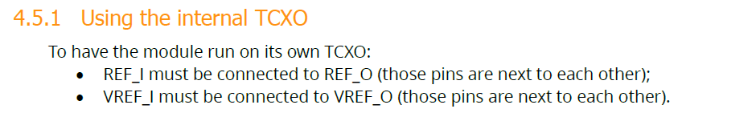

Layout connections for REF and VREF_I.

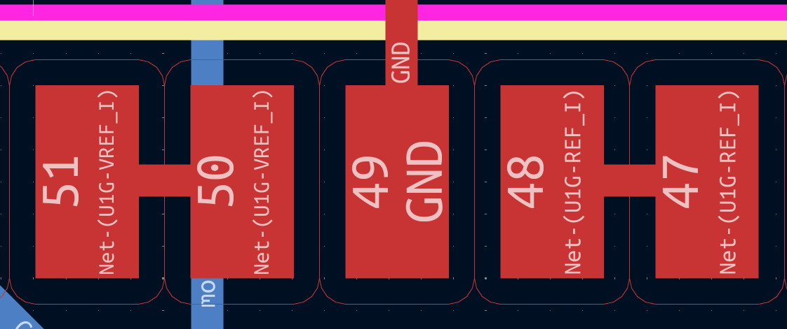

### Further improvements