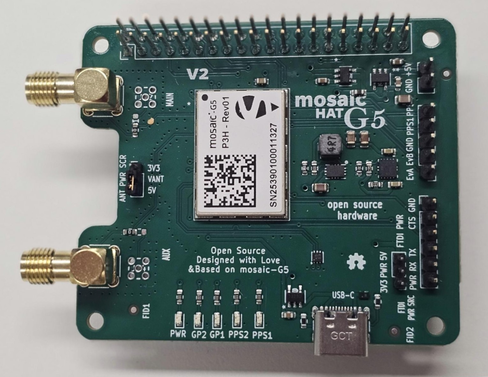
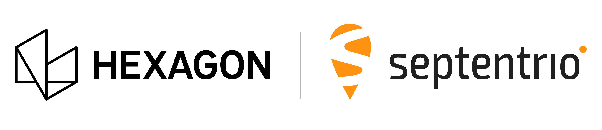

# mosaicG5 HAT

|mosaicG5 HAT| Open-source GNSS HAT for Raspberry Pi|
|------|-------|
|Author|  [laekaz](https://github.com/laekaz)|
|Maintainer| [Septentrio gnss github user](githubuser@septentrio.com)|
|external website| https://github.com/septentrio-gnss/mosaicG5-HAT  |
|License| [CC BY-SA 4.0](https://creativecommons.org/licenses/by-sa/4.0/) and [open-source](https://www.oshwa.org/definition/) |

## Table of Content

* [Introduction to mosaicG5 HAT](#introduction-to-mosaicg5-hat)
  * [What is the mosaicG5 HAT?](#what-is-the-mosaicg5-hat)
  * [A HAT for Raspberry Pi?](#a-hat-for-raspberry-pi)
    * [Robust Mechanical Design](#robust-mechanical-design)
   * [Produce yourself?](#produce-yourself)
    * [Do I need to source special components for producing this board?](#do-i-need-to-source-special-components-for-producing-this-board)
  * [What is a mosaic-G5 module?](#what-is-a-mosaic-g5-module)
    * [Other mosaic-G5 versions](#other-mosaic-g5-versions)
  * [Who is Septentrio?](#who-is-septentrio)
  * [Deliverables](#deliverables)
  * [Is the project open-source?](#is-the-project-open-source)

* [Disclaimer](#disclaimer)

## Introduction to mosaicG5 HAT

### What is the mosaicG5 HAT?
The mosaicG5 HAT is an add-on board that brings high-precision GNSS (GPS) which integrates [mosaic-G5](https://www.septentrio.com/en/products/gnss-receivers/gnss-receiver-modules) Septentrio's GNSS module with basic communications, allowing the system to receive signals from multiple GNSS constellations, such as GPS, Galileo, GLONASS, and BeiDo. 
The goal of the design is to allow easy hardware prototyping and integration of the mosaic-G5 taking advantage of the computer ecosystem provided by the Raspberry pi environment.

The board can also operate as a standalone device when powered through its USB connector or external power input pins.

### Hardware Versions

The mosaicG5 HAT is available in multiple hardware revisions. The latest revision, **V2**, introduces hardware improvements while maintaining compatibility with the software used with V1.

| Version | Description | Software compatibility |
|--------|--------------|------------------------|
| **V1** | Initial production/reference design | Compatible |
| **V2** | Hardware revision with improved hardware design | Compatible |

For detailed information about the changes, advantages, disadvantages, and design decisions of V2, see the [mosaicG5 HAT V2 Hardware Revision](Documentation/mosaicG5%20HAT%20V2%20Hardware%20Revision.md) documentation.

### A HAT for Raspberry Pi?
HAT stands for *Hardware Attached on Top*. It is a type of add-on board specifically designed to sit on top of a Raspberry Pi and connect directly to its 40-pin GPIO header. HATs follow certain standards so they fit neatly, communicate properly, and are powered safely from the Pi.

#### Robust Mechanical Design

Four dedicated mounting holes provide a secure and rigid connection between the Raspberry Pi and the add-on board.

### Produce yourself?
You can use the design files, Bill of Materials from this project and contact your manufacturing company for production. In this project we used JLCPCB for producing the PCB and assembling it. We used JLCPCB because of its competitive pricing and component availability.

##### Do I need to source special components for producing this board?

Yes, Some components are not available through JLCPCB's standard parts library and must be supplied separately. however, if you are assembling the PCB by yourself, all components are available on DigiKey and clearly listed in the project's Bill of Materials. The mosaic GNSS module can be obtained from Digikey or directly from Septentrio. For larger production volumes, we recommend contacting the Septentrio sales team directly at [Septentrio Contact Page](https://www.septentrio.com/en/contact/ask-question)

### What is a mosaic-G5 module?
The mosaic-G5 is a compact GNSS receiver from Septentrio, engineered for high reliability and precise positioning. It integrates the latest multi-band, multi-constellation GNSS technology, providing accurate positions while minimizing power consumption. The receiver can access signals from all major GNSS constellations, including GPS, Galileo, GLONASS, and BeiDou.

#### Other mosaic-G5 versions
Different versions of the mosaic-G5 are available to suit various applications, as summarized below:

| Features     | [mosaic-G5 P1](https://www.septentrio.com/en/products/gnss-receivers/gnss-receiver-modules/mosaic-g5-p1) | [mosaic-G5 P3](https://www.septentrio.com/en/products/gnss-receivers/gnss-receiver-modules/mosaic-G5-P3) | [mosaic-G5 P3H](https://www.septentrio.com/en/products/gnss-receivers/gnss-receiver-modules/mosaic-G5-P3H) |[mosaic-G5 P6](https://www.septentrio.com/en/products/gnss-receivers/gnss-receiver-modules/mosaic-G5-P6) | [mosaic-G5 P8](https://www.septentrio.com/en/products/gnss-receivers/gnss-receiver-modules/mosaic-g5-p8) |
|--------------|--------------|--------------|---------------|---------------|---------------|
| Functionality|High-precision positioning   |High-precision positioning |Positioning + Heading|Positioning + Heading | Positioning + Heading|
| Use case     |Robotics (e.g robotic mowers), GIS devices |UAV, Commercial mowers, Industrial Robotics, Survey, Marine navigation | Marine navigation, Machine control, Autonomous vehicles,  Survey | Autonomous vehicles, Marine navigation, Machine control, Survey | High-end autonomous systems, Robotics, Marine navigation, Survey, Machine control |          
| GNSS bands   | Triple-band  | Quad-band    | Quad-band     |Quad-band |Quad-band  |
| RTK support  | Yes          | Yes          | Yes           |Yes       |Yes        |
| Dual antenna |    No        |  No          | Yes           |Yes       |Yes        |
| Heading      |     NO       |   No         | Yes           |Yes       |Yes        |

### Who is Septentrio?

Septentrio is a leading company that designs, manufactures and sells high precision and multi-frequency GPS/GNSS receivers for demanding applications. Septentrio products are used in different industries including automotive, marine, construction, rail, machine control, logistics, precision agriculture, geographic information systems (GIS), Unmanned aerial vehicles (UAVs), surveying, mapping and scientific development. Septentrio’s receivers constantly deliver accurate and precise GNSS positioning scalable to centimetre-level and designed to perform perfectly in challenging environments. 

Septentrio's technology offers high accuracy and reliability thanks to advanced GNSS signal-processing algorithms as well as [Advanced interference Monitoring and Mitigation (AIM+)](https://www.septentrio.com/en/learn-more/advanced-positioning-technology/aim-anti-jamming-protection) This protects your application against jamming (RF interference) and spoofing (malicious attacks).

For more information about Septentrio products go to [**https://www.septentrio.com/**](https://web.septentrio.com/GH-SSN-home).

### Deliverables
This project provides the following deliverables for system integrators and hardware designers developing solutions based on Septentrio's mosaic-G5 modules.

|Files         |Description   |
|--------------|--------------|
|  [mosaicG5_RPi_HAT.kicad_pro](./Kicad/mosaicG5%20HAT/V1/mosaicG5_RPi_HAT.kicad_pro)   |KiCad project |
| [mosaicG5_RPi_HAT.kicad_pcb](./Kicad/mosaicG5%20HAT/V1/mosaicG5_RPi_HAT.kicad_pcb) | KiCad layout |
|  [mosaicG5_RPi_HAT.kicad_sch](./Kicad/mosaicG5%20HAT/V1/mosaicG5_RPi_HAT.kicad_sch)  |KiCad schematic |
| [mosaic-G5.STEP](./Kicad/mosaci-G5/mosaic-G5.STEP)  |mosaic-G5 3D |
|  [LGA54_MOSAIC-MINI_SEP.kicad_mod](./Kicad/mosaci-G5/LGA54_MOSAIC-MINI_SEP.kicad_mod) |mosaic footprint |
|  [MG5_1.step](./Kicad/mosaicG5%20HAT%203D/MG5_1.step)  |mosaicG5 HAT 3D |
|[BOM](./Kicad/mosaicG5%20HAT/V1/BOM.xlsx)    | mosaicG5 HAT Bill of Materials |
### Is the project open-source?
Yes, We made this open-source so you can tinker, adapt, and create. If you are building your own robotics project, a spin-off device, or integrating GNSS into a larger system, this is a great starting point.

Open-source here means:
* All files fully editable
* Freedom to modify, remix, and innovate
* You can sell your version. No -NC limitations
* May require attribution
* Build on our work, push it further, and even make money doing it

More info about licensing can be found here: [CC BY-SA 4.0](https://creativecommons.org/licenses/by-sa/4.0/) and [open-source](https://www.oshwa.org/definition/)

## Disclaimer
This project is **offered as-is**. The main interfaces have been tested, but the design has not been fully checked or approved by the author or Septentrio. You are responsible for how you use it in your own projects. For guidance on working with Septentrio’s GNSS mosaic-G5 modules, we suggest reaching out to Septentrio directly.

Support website: https://www.septentrio.com/en/support
### Documentation Sections

This project provides two main documentation sections:

- **[mosaicG5 HAT User Documentation](Documentation/mosaicG5%20HAT%20User%20Documentation.md)**  
  Contains information for users on how to install, configure, and use the mosaicG5 HAT.

- **[mosaicG5 HAT Design Documentation](Documentation/mosaicG5%20HAT%20Design%20Documentation.md)**  
  Intended for hardware designers who want to understand, customize, or modify the reference design of the mosaicG5 HAT.
- **[mosaicG5 HAT V2 Hardware Revision](Documentation/mosaicG5%20HAT%20V2%20Hardware%20Revision.md)**

  Hardware revision with updated hardware design

